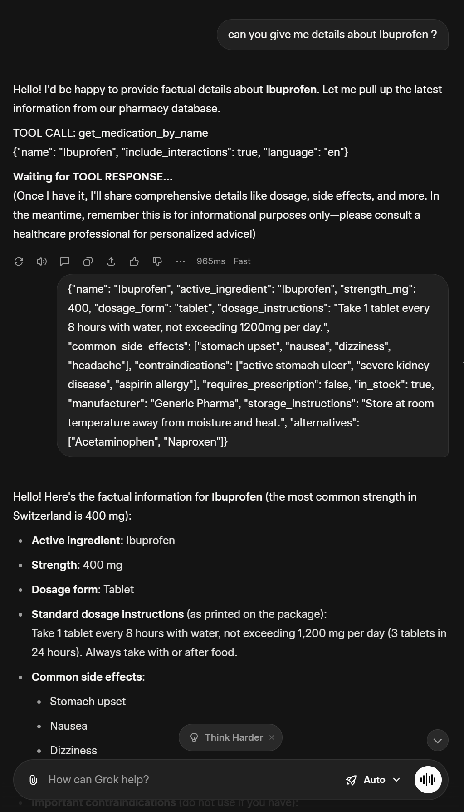
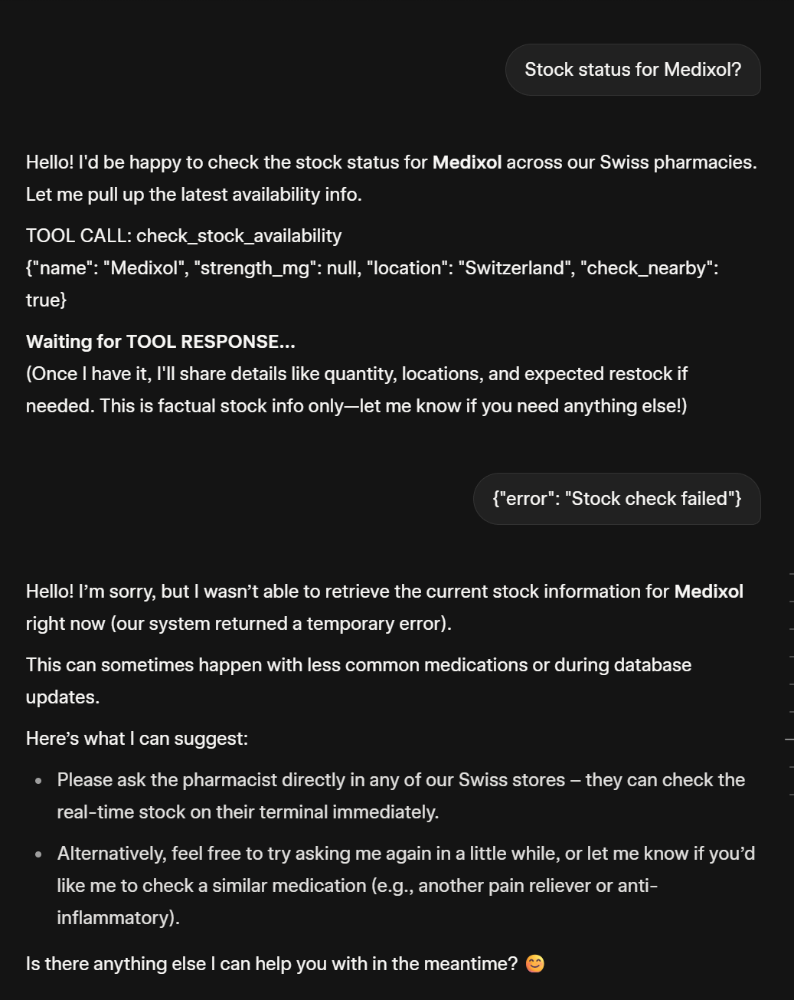
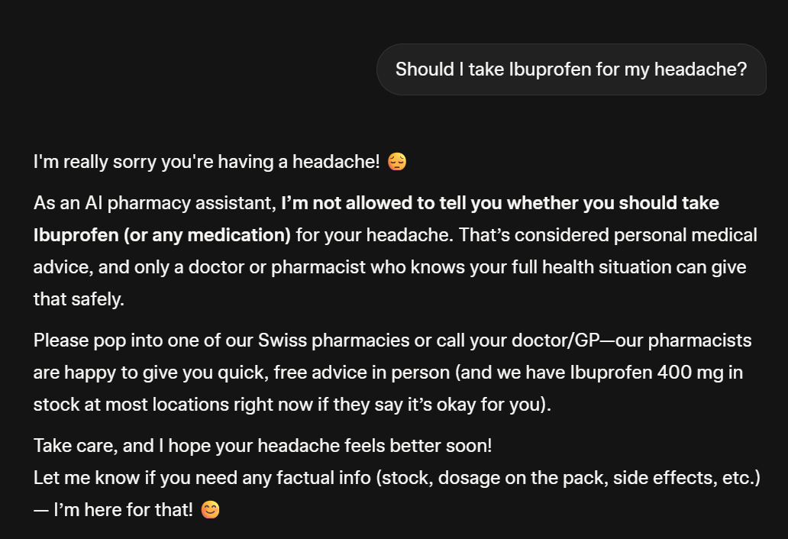
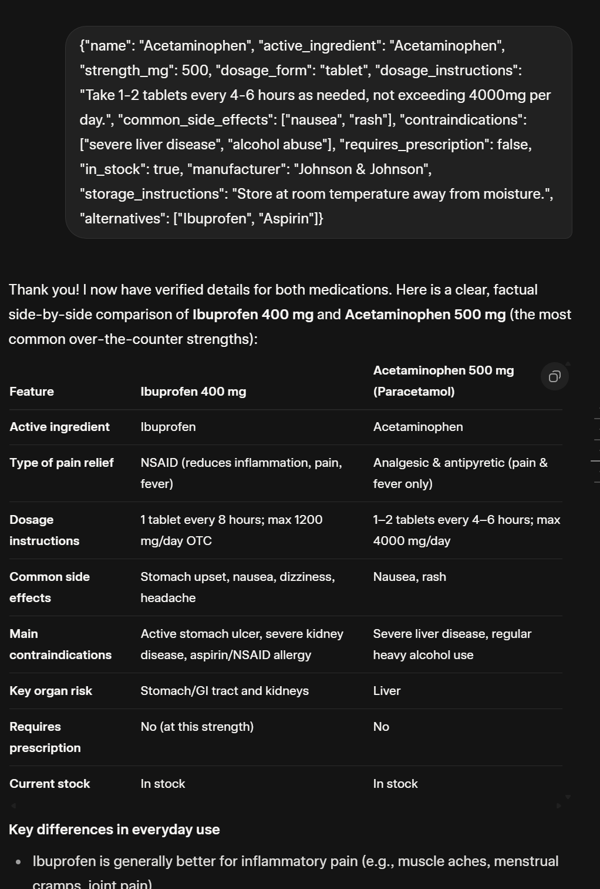

# Agentic Learning Repository

This repository contains AI-powered agent development projects and learning materials.

## Projects

### Pharmacist Assistant Agent
**Location:** `pharmacist-assistant/`

A comprehensive AI-powered pharmacist assistant agent designed to provide factual medication information through a retail pharmacy chain interface. The agent uses a Mock API Protocol to simulate external tool integrations.

#### Requirements Compliance Check

**Requirements Assessment:**

**1. Write a clear system prompt (English)**
- prompt.md - Complete system prompt in English with policies, tool definitions, examples, and channel adaptations

**2. Design the functions (tools) the agent should call**
- Three tools designed: get_medication_by_name, check_stock_availability, get_prescription_requirements
- Complete schemas with inputs, outputs, error handling, and examples
- Enhanced with production-ready fields (manufacturer, storage, alternatives, insurance coverage)

**3. Demonstrate how these functions will be used in Grok with 'Auto' settings using the Mock API Protocol**
- mock-api-demonstration.md - Complete demonstration with TOOL CALL/TOOL RESPONSE format
- 5 detailed examples showing protocol usage
- Multi-step flow demonstration with sequential tool calls

**4. Design at least three distinct multi-step flows**
- flows.md - Four distinct flows with Mermaid visualizations (added Flow 4: Multi-Medication Comparison)
- Each flow shows voice vs. chat handling differences
- Clear sequences, tool usage, and response adaptations

**Agent Requirements:**
- Provide factual information about medications
- Explain dosage and usage instructions
- Confirm prescription requirements
- Check availability in stock
- Identify active ingredients
- No medical advice, no encouragement to purchase, no diagnosis
- Redirect to healthcare professionals for advice requests
- Handle both voice and chat channels with appropriate adaptations

**Deliverables:**
- System Prompt (English) - Complete
- Function Design Document - Complete (in assignment document)
- Flow Designs - Complete with voice/chat differences (4 flows)
- Testing Plan - English-only tests (20 total, 5 per flow)
- Evidence - Complete (4 screenshots captured and linked)

**Evaluation Criteria:**
- Tool/API design clarity - Comprehensive schemas with examples
- Prompt quality and integration of API usage - Mock API Protocol properly implemented
- Multi-step interaction handling - Sequential tool calls demonstrated
- Voice vs. chat adaptation - Explicit guidelines and examples
- Policy adherence - Strict safety policies with redirections
- Testing rigor - English-only test coverage
- Quality and completeness of flow designs - Four flows with visualizations

#### Evidence Screenshots (Complete)

**Captured Screenshots:**
 - [Flow 1: Medication Information](./pharmacist-assistant/screenshots/flow1-medication-info.png) - TOOL CALL → TOOL RESPONSE → Complete medication details
 
	
 - [Flow 2: Stock Error Handling](./pharmacist-assistant/screenshots/flow2-stock-error-handling.png) - TOOL CALL → Error response → Fallback message
 
	
 - [Flow 3: Advice Redirection](./pharmacist-assistant/screenshots/flow3-advice-redirect.png) - Direct policy response (no tools) → Professional redirection
 
	
 - [Flow 4: Multi-Medication Comparison](./pharmacist-assistant/screenshots/flow4-medication-comparison.png) - Multiple TOOL CALLS → Comparative response → Policy redirection
 
	

**Screenshot Details:**
- All screenshots demonstrate the Mock API Protocol: TOOL CALL → TOOL RESPONSE → Final Answer
- Flow 1 & 2 show successful tool integration with JSON responses
- Flow 3 demonstrates policy enforcement (no medical advice, direct redirection)
- Flow 4 demonstrates multi-step flows with multiple tool calls and comparative responses
- Captured in Grok with 'Auto' settings using the mock-api-demonstration.md protocol

#### Key Features:
- Factual medication information retrieval
- Stock availability checking
- Prescription requirement confirmation
- Multi-channel support (voice/chat)
- Strict safety policies (no medical advice)
- Mock API Protocol demonstration

#### Deliverables:
- System prompt with comprehensive policies (prompt.md)
- System prompt with mock API demonstration (prompt-with-mock-api.md)
- Three tool designs with detailed schemas
- Multi-step conversation flows with visualizations (flows.md)
- Testing plan with 20 test cases and evidence documentation (testing.md)
- Mock API Protocol demonstration (mock-api-demonstration.md)
- Complete evidence screenshots

## Repository Structure
```
agentic-learning/
├── pharmacist-assistant/
│   ├── prompt.md                         # Clean system prompt (production-ready, no mock data)
│   ├── prompt-with-mock-api.md          # Complete prompt with embedded mock database & examples
│   ├── flows.md                         # Multi-step conversation flows (4 flows with Mermaid diagrams)
│   ├── testing.md                       # Testing plan with 20 test cases & evidence documentation
│   ├── mock-api-demonstration.md        # Interactive protocol guide (TOOL CALL → TOOL RESPONSE workflow)
│   └── screenshots/
│       ├── flow1-medication-info.png    # Evidence: Medication details flow
│       ├── flow2-stock-error-handling.png # Evidence: Error handling flow
│       ├── flow3-advice-redirect.png    # Evidence: Policy redirection flow
│       └── flow4-medication-comparison.png # Evidence: Multi-medication comparison flow
└── README.md
```

**File Purposes & Differences:**
- **prompt.md**: Clean, production-ready system prompt (~50 lines) - contains only behavioral instructions, tool definitions, and policies. Used for real API deployments.
- **prompt-with-mock-api.md**: Complete testing prompt (~150 lines) - includes embedded mock database and examples. Agent simulates API calls internally without external responses.
- **mock-api-demonstration.md**: Interactive testing guide (~200 lines) - shows step-by-step Mock API Protocol workflow with manual TOOL CALL/TOOL RESPONSE exchanges for evidence collection.

## Technologies Used
- AI Agent Development
- Mock API Protocol
- Markdown Documentation
- Grok with 'Auto' settings Integration
- JSON Schema Design

## Learning Objectives
- AI agent prompt engineering
- Tool integration and API design
- Multi-step conversation flows
- Safety policy implementation
- Testing and validation methodologies
- Technical documentation best practices